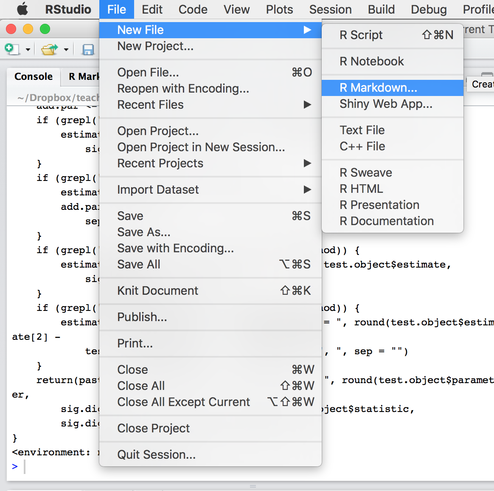
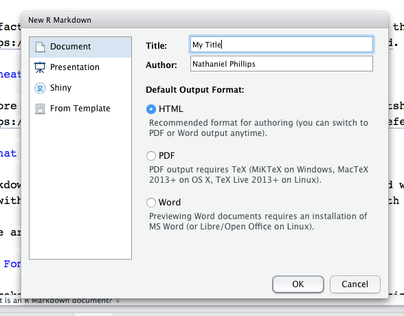
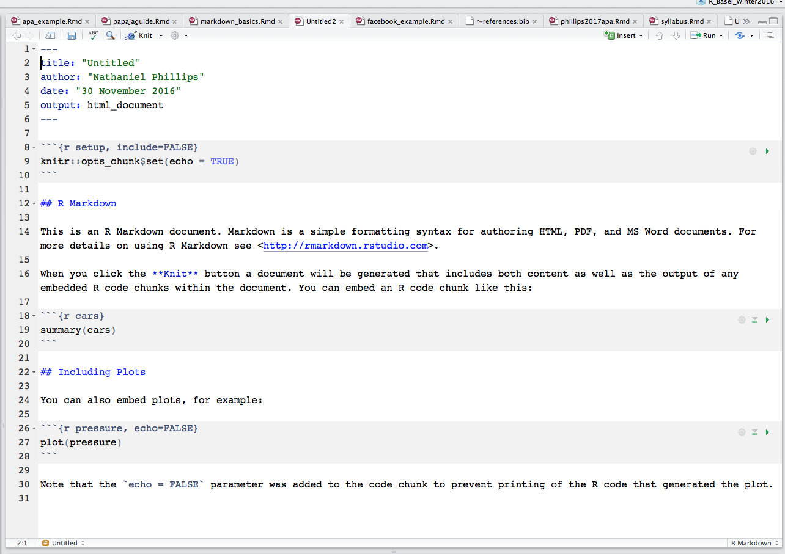

<!-- rnb-text-begin -->

---
title: "Introduction to R Markdown"
author: "Hicham Zmarrou"
date: "Notebook -- <http://bit.ly/>  <br /> <br />"
output:
  html_document:
    fig_caption: yes
    toc: yes
  html_notebook:
    fig_caption: yes
    highlight: pygments
    number_sections: no
    theme: cosmo
    toc: yes
    toc_float: yes
subtitle: null
venue: TNO R courses
---


<hr>

[Visit my website](http://trefoil.ml/) for more like this!

__References__

Most of this material is borrowed from the official [R markdown website](http://rmarkdown.rstudio.com/)

______________________________________________________________________________________________________________________________________

This lesson will teach you the basics of an R Markdown document. R Markdown is a special file type with the `.Rmd` suffix. It is combination of text, `Markdown`, and `R` code. Once you've written an R Markdown document, you can "knit" the document to construct all kinds of nicely formatted documents, from reports in PDF (including APA style with the  papaja package), to web pages in HTML, or Word documents.


<div >
<center></center>
</div>

Let's go through the steps of creating your first R Markdown document. The main steps are as follows

* Create a new R Markdown `.Rmd` document.

* Write text with Markdown tags for formatting.

* Add R chunks, inline code, and tables

* Knit the R Markdown document to a final document in HTML, PDF, or Word format

## Download the cheatsheet!

Before you do anything, you should open this very helpful cheatsheet written by RStudio available at [this website](https://www.rstudio.com/wp-content/uploads/2015/03/rmarkdown-reference.pdf).


## Create new Markdown document

An R Markdown document is a special document with the .Rmd suffix - unlike R documents which have the .R suffix.

## Open a new blank R Markdown (.Rmd) document

To create a new R Markdown document in RStudio, click File - New File - R Markdown.

<div style="width:360px; height=250px">
<center></center>
</div>


You'll see the following window show up. You can change the title or author of your document here, as well as the output format. However, you can also change all of these later. Just click ok.

<div style="width:360px; height=250px">
<center></center>
</div>

Now, you should see a new blank markdown document open like this one:

<div style="width:360px; height=250px">
<center></center>
</div>

As you can see, the new document will already have some text in it to help you get started.

## Open a template

Another good way to get started with R Markdown is to look at an example. Here are two example documents. Open them in your browser, then copy and paste all of the text into an R

* Markdown basics [this page!](https://dl.dropboxusercontent.com/u/7618380/markdown_basics.Rmd); or this  page 

* [Facebook study](https://dl.dropboxusercontent.com/u/7618380/facebook_example.Rmd)

* [Facebook study in APA format using the papaja R package](https://dl.dropboxusercontent.com/u/7618380/phillips2017apa.Rmd)


## What is Markdown?

Markdown is a combination of regular text (like this), combined with tags that change the way the text is formatted. For example, to make text italic you surround it with one asterix. To make text bold, you surround it with two asterices. To create section headings, you use hashtags #.

Here are the most common formatting tags:

### Font tags: Italic, bold, and headers

* To make headers in Markdown, use the `#` pound symbol at the beginning of a line

* To make text italic, use a single `*` before and after the text.

*  To make text bold, use a double `**` before and after the text.

* Section tags: #, ##, ###, .

To create section headings (aka, sections), use the # hashtag symbol. The number of #'s you use will dictate the level of the header.

 #Method (level 1)

 ##Participants (level 2)

 ###Statistics (level 3)

### List tags

To make a numbered list, just use numbers

1. First element

2. Second element

3. Third element

To make a non-numbered list, use dashes -

* First element

* Second element

* Third element

### R Code Chunks

The coolest part of R Markdown is that it allows you to incorporate R code, and the results of R code (like statistics and plots), directly into your document. To incorporate R code, you need to tell Markdown when you are writing code and when you are writing regular text. Unless you tell it otherwise Markdown will treat all your text as regular text.

For example, if I write 1 + 1, R thinks I am writing regular text and won't interpret it as R code. To tell Markdown that you are writing R code, you need to put the R code in a code chunk. A code chunk starts with `` ```{r} `` 
on one line and ends with ` ``` `  on one line. Everything you put in this chunk will be evaluated by R Markdown as R code when you Knit the document (we'll get to Knitting a bit later). Here's how a code chunk looks


<!-- rnb-text-end -->


<!-- rnb-chunk-begin -->


<!-- rnb-chunk-end -->


<!-- rnb-text-begin -->


1. As you can see, code chunks in RStudio are highlighted with a gray background. You can insert a new code chunk in one of three ways

2. Manually type the starting code`` ```{r} `` 
on one line and ends with ` ``` ` on the next line. Now everything between these lines will be interpreted as R code.

3. Use the Ctrl-Alt-I shortcut. This will automatically create a new code chunk.

4. Click the "Insert new code chunk" button on the top right hand of the Source panel. It looks like a green square with an arrow.


### Evaluating chunks

Just like writing code in a regular R script, you will want to test your code in code chunks to make sure it's doing what you want (and doesn't have bugs). You can evaluate your code chunks in the different ways described in the `run`button in `Rstudio`

In RStudio, there is also a point and click menu for evaluating chunks. You can open the menu by clicking the box with the Run name on the top of the Source window (next to the Insert Chunk menu).


##  Chunk options

You can add arguments at the start of code chunks to change how the code is evaluated and presented. These arguments go in the first line `` ```{r, ARGUMENTS} `. For example, you can tell R to echo (that is repeat) the code in the document by including the `echo = TRUE` argument, or change the size of figures created in the chunk with the `fig.width` and `fig.height` arguments. Here are the most common:

### echo = FALSE, echo = TRUE

By default, Markdown will repeat (aka, echo) your R code in your final output. However, if you don't want it to do this, add the `echo = FALSE` argument.

In the following code, I will write some comments and calculate the mean weight of chickens in the ChickWeight dataset. Because I include the `echo = FALSE` argument at the top of the chunk, the chunk will only print the result in the final output, not the original R code:


<!-- rnb-text-end -->


<!-- rnb-chunk-begin -->


<!-- rnb-chunk-end -->


<!-- rnb-text-begin -->


If I do not include the `echo = TRUE` argument, R will print the original code and the result


<!-- rnb-text-end -->


<!-- rnb-chunk-begin -->


<!-- rnb-source-begin eyJkYXRhIjoiYGBgclxuIyBOb3cgUiB3aWxsIGNvcHkgdGhlIGNvZGUgYW5kIGdpdmUgdGhlIHJlc3VsdCBiZWNhdXNlIEkgZGlkIG5vdCBpbmNsdWRlXG4jIGVjaG8gPSBGQUxTRVxuXG4jIFdoYXQgaXMgdGhlIG1lYW4gd2VpZ2h0IG9mIGNoaWNrZW5zP1xubWVhbihDaGlja1dlaWdodCR3ZWlnaHQpXG5gYGAifQ== -->

```r
# Now R will copy the code and give the result because I did not include
# echo = FALSE

# What is the mean weight of chickens?
mean(ChickWeight$weight)
```

<!-- rnb-source-end -->

<!-- rnb-chunk-end -->


<!-- rnb-text-begin -->


### eval = FALSE, eval = TRUE

If you include the `eval = FALSE` argument, R will NOT evaluate code in a chunk. This can be helpful for storing code that you may want to evaluate later.


<!-- rnb-text-end -->


<!-- rnb-chunk-begin -->


<!-- rnb-chunk-end -->


<!-- rnb-text-begin -->


If I include BOTH `echo = FALSE`, and `eval = FALSE`, `R` will neither copy nor evaluate the code. That is, it will completely ignore it.


### fig.width, fig.height

To add a plot to a markdown document, just insert the plotting code (like `hist()`, `plot()`, or `pirateplot()`) in a chunk. Markdown will place the resulting plot just below the chunk you used to create the plot. Here's a pirateplot of the weight of chickens:


<!-- rnb-text-end -->


<!-- rnb-chunk-begin -->


<!-- rnb-chunk-end -->


<!-- rnb-text-begin -->


You can used chunk arguments to change the size of a plot. The fig.width and fig.height chunk options will change its size. For example, the following chunk will print a small plot as I set fig.width = 3 and fig.height = 3

<!-- rnb-text-end -->


<!-- rnb-chunk-begin -->


<!-- rnb-chunk-end -->


<!-- rnb-text-begin -->


### fig.align, fig.cap

You can also change the alignment of a plot with fig.align, and add a caption with fig.cap. In the next plot, I'll add a caption:


<!-- rnb-text-end -->


<!-- rnb-chunk-begin -->


<!-- rnb-chunk-end -->


<!-- rnb-text-begin -->


### message = TRUE, message = FALSE

Some R code will return messages to the console that you don't want in your document. For example, when you load a `package` with `library(package)`, an annoying message will be printed for some output types. To prevent messages like these from showing up in your document, include the `message = FALSE` argument.


<!-- rnb-text-end -->


<!-- rnb-chunk-begin -->


<!-- rnb-chunk-end -->


<!-- rnb-text-begin -->


### Setting default chunk options

You can set default options for all of your R chunks by running knitr::opts_chunk$set in a chunk in the beginning of your document.

For example, if I include the following chunk at the beginning of my docuemnt, all future chunks will not echo by default, and all figures will have a width and height of 4.


<!-- rnb-text-end -->


<!-- rnb-chunk-begin -->


<!-- rnb-chunk-end -->


<!-- rnb-text-begin -->


### Inline code

In addition to creating regular code chunks, you can create inline that go directly into your text. This allows you to directly incorporate R output (such as sample statistics) into your text without having to type it directly. For example, let's say I conducted a `t-test` and wanted to report the result. To do this in Word, you'd have to conduct the test, visually look up the result, and then manually type something like: "The p-value of the test was .02". However, this can lead to serious problems: you might type the p-value incorrectly, or you might type in the value from the wrong test. Inline code solve both of these problems by allowing you to print statistical results directly with R. Using inline code, I can write something like "The p-value of the test was `test$p.value` ". When you knit the document, Markdown will replace the code `test$p.value` with the actual p-value from the test!

Inline code always starts and ends with a tilde backtick. If you want the inline code to be run, start with ``r` , if you just want to print the code without actually running it, just start with ` (without the r):


<!-- rnb-text-end -->


<!-- rnb-text-begin -->


For example, when I write: "The mean weight of chickens was `round(mean(ChickWeight$weight), 0)` ", you'll see the actual code, rather than the result of the code, in the knitted document because I didn't include `r` at the beginning of the inline code

However, when I write "The mean weight of chickens was  122 ", you'll see the result of the code in the final document because I did include r at the beginning.

You can think about the starting `r` as the inline equivalent of eval = TRUE, echo = FALSE for a regular code chunk.

### Combining chunks with inline code

You can use inline code to refer to objects you create in regular chunks. For example, in the following chunk, I'll defines define a vector scores:


<!-- rnb-text-end -->


<!-- rnb-chunk-begin -->


<!-- rnb-chunk-end -->


<!-- rnb-text-begin -->


Now that the objects are defined, I can use them in a inline code as in the following sentences. In the first sentence, I'll just echo the inline code without evaluating it:

I collected scores from `length(scores)`   participants. The mean was round(mean(scores), 2) and the standard deviation was `round(sd(scores), 2)`.

Now I'll evaluate the inline code to print the results!

I collected scores from 6 participants. The mean was 3.83 and the standard deviation was 1.17.

If you haven't noticed this already.inline code is a huge deal! They allow you to make your analysis completely replicable and free of typing errors. When you are writing documents, you should write all of your statistical results in your text as inline codes!

### Tables

There are three main ways to create tables in Markdown. You can either write them by hand, copy examples from other documents, or use R functions like `kable()` from the knitr package to create them automatically from dataframes.
1. The hard way to create tables in Markdown is to write them by hand using dashes and pipes. Here is an example (I'm putting it in an R chunk just so you can see the code in the final document)

```
| weight| Time|Chick |Diet |
|------:|----:|:-----|:----|
|     42|    0|1     |1    |
|     51|    2|1     |1    |
|     59|    4|1     |1    |
|     64|    6|1     |1    |
|     76|    8|1     |1    |
|     93|   10|1     |1    |

```

2. Use a Markdown table generator like the one [here](http://www.tablesgenerator.com/markdown_tables). This generator allows you to create tables visually using a point and click interface (like you would use in Word) and then convert the table into Markdown code that you can then paste into your Markdown document.

3. Use the `kable()` function in the knitr package. The `kable()` function will convert any dataframe into a Markdown table. For example, in the following chunk, I'll create a dataframe called my.table, and then use  `kable()` to create a table in markdown format.


<!-- rnb-text-end -->


<!-- rnb-chunk-begin -->


<!-- rnb-chunk-end -->


<!-- rnb-text-begin -->


When you include `kable()` in a chunk in R Markdown, the table will automatically be included in your document when you knit it. That is, you will never actually see the Markdown code that generated the table. If you want to see the actual table in Markdown, maybe because you want to customise it or include it in a separate markdown document, you can run the `kable()` function in R to print the table in Markdown format to the console.

For more tips on customizing tables, check out the R markdown cheatsheet and the help menu for `kable()` with  `?kable()`.


### Knitting (creating) a document

To create a document (usually HTML, or PDF) from `rmarkdown`, you need to Knit the document. Knitting a document simply means taking all the text and code and creating a nicely formatted document in either HTML, PDF, or Word.

To Knit a document from your markdown file, do one of the following

Click the "Knit" or "Preview" if you are using R notebook button at the top of this window. It will have a picture of a ball of yarn. Here, you can also select the type of document (HTML, PDF, or Word) to create.


### Why won't my document Knit?

There are many reasons why your document might not successfully knit. Here are the most common two reasons:

#### You must define ALL objects and load all libraries in your markdown

When you knit a markdown document, R will create it using an entirely new, blank workspace independently of the workspace you are using when you write the document. This means that in order for your document to knit, you need to explicitly define all objects in R chunks within the document. For this reason, if you are conducting any analyses in your markdown document, you should always begin your markdown documents with an R chunk that loads in any datasets (e.g.; using `read.table()`, or `load()`). If you don't do this, any analyses you define in the document will return errors because they won't be able to find the data!

If you use functions from a package in your code, you must explicitly load the package in your Markdown document using `library()` before using the package. If you don't, Markdown won't know which packages you're using and the code won't work.


<!-- rnb-text-end -->


<!-- rnb-chunk-begin -->


<!-- rnb-chunk-end -->


<!-- rnb-text-begin -->


#### If your R code has ANY errors, the document will not knit!

If your R code (in any standard chunks or inline codes) contains R errors, the document will not knit and the resulting document will not be created! Instead, you will see a series of errors and warnings, which may or may not help you diagnose the error. If your document does not knit, you need to go through your code chunk by chunk and find the error!

Here is the best way to check your R Markdown documents for potential knitting errors:

* Clear your workspace by running rm(list = ls())

* Evaluate each chunk sequentially. You can do this by copying and pasting each chunk to the console or using the the differents options under thwe `run` button in `Rstudio`. 

### Publish your markdown documents to RPubs!

One of the best things about `R` is the R community. `R` users are incredibly friendly and open. To be a part of the community, you should share your code! Thankfully, this is super easy to do using an R Markdown document. Once you've knitted an R Markdown document to HTML, you can publish the document online using the Publish button. This button is located on the top right corner of the Viewer window. When you click this, you will see the option to publish your document to RPubs - a website dedicated to distributing R Markdown documents. I highly recommend you do this and share your results!


<!-- rnb-text-end -->

